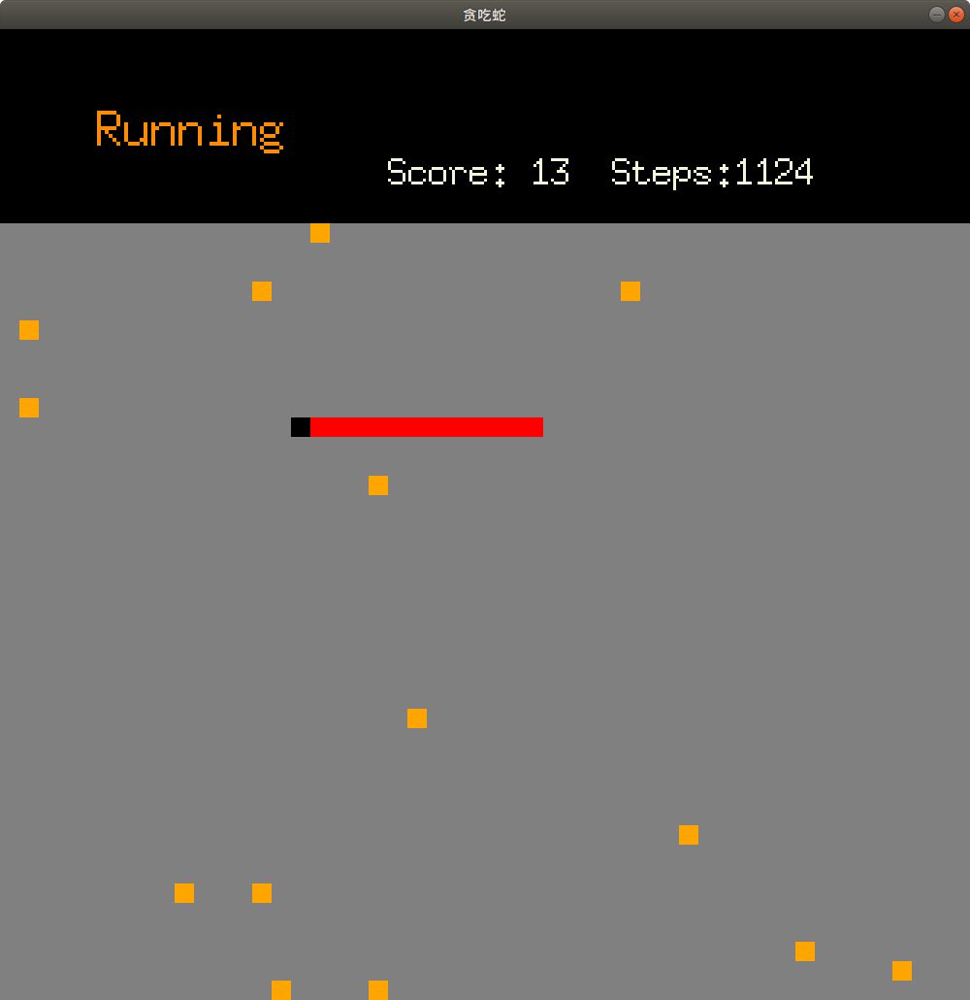

# 用go实现贪吃蛇小游戏


写个小游戏可能任何语言都能实现，go也不例外。

所需要的无非是一个图形框架，能够绘制图像，响应点击事件。

这里我们采用的是[pixel](github.com/faiface/pixel)一个由go写的2D游戏框架。
## 安装
pixel 依赖于opengl 安装参考[pixel requirements](https://github.com/faiface/pixel#requirement)

图形库使用参考[pixel](https://github.com/faiface/pixel)


## 基本原理

```go
import	"github.com/faiface/pixel/pixelgl"
func main() {
	pixelgl.Run(run)
}
func run() {
	cfg := pixelgl.WindowConfig{
		Title:  "贪吃蛇",
		Bounds: pixel.R(0, 0, 1000, 1000),
		VSync:  true,
	}
	win, err := pixelgl.NewWindow(cfg)
	if err != nil {
		panic(err)
	}
	for !win.Closed() {
        // --------- add logic here ********
        // 响应点击事件
        // 绘制图形
        // ...
		win.Update()
	}
}
```
上面的代码会创建一个1000X1000窗口，我们可以在上面的for循环内响应点击事件，绘制图像。
### 点击事件
```golang
for !win.Closed() {
	if win.JustPressed(pixelgl.KeyLeft) {
           // add logic here
	}
}
```
### 图像绘制
```
 绘制一个矩形

    ^ y
    |
    | .......................
20  |.....D.....C............
    |........................
10  |.....A.....B............
    |........................
    ______________________> x
         10     20

imd := imdraw.New(nil)
imd.Color==color.RGBA{R:0xFF,G:0,B:0,A:0xff} // 设置颜色
imd.Push(pixel.V(10,10))  // A
imd.Push(pixel.V(20,10))  // B
imd.Push(pixel.V(20,20))  // C
imd.Push(pixel.V(10,20))  // D
imd.Polygon(0)            // 绘制多边形 A,B,C,D  ,0 表示填充
imd.Draw(win)          
```
### 游戏逻辑
* 开一个线程定时刷新蛇的位置和状态
* 在窗口中绘制图像,并响应点击事件


#### 贪吃蛇表示
它有如下状态
* 身体以及位置（可以用数组+二维坐标表示）
* 移动方向
* 状态（是否死亡） 

```go
// 身体表示
type Snack{
    body [][2]int
}
type (s *Snack)step(){
    for i:=0;i<len(s.body)-1;i++{
        // 向前移动一步
		s.body[i][0]=s.body[i+1][0]
		s.body[i][1]=s.body[i+1][1]
	}
	s.body[len(s.body)-1]=s.newEnd()  // 更新头部位置
}
// 根据移动方向获取头部新位置
func (s *Snake) newEnd()[2]int{
	offsetX:=0
	offsetY:=0
	switch s.direction{
	case Top:
		offsetY=1
	case Right:
		offsetX=1
	case Bottom:
		offsetY=-1
	case Left:
		offsetX=-1
	}
	x:=s.body[len(s.body)-1][0]+offsetX
	y:=s.body[len(s.body)-1][1]+offsetY
	return [2]int{x,y}
}
```

